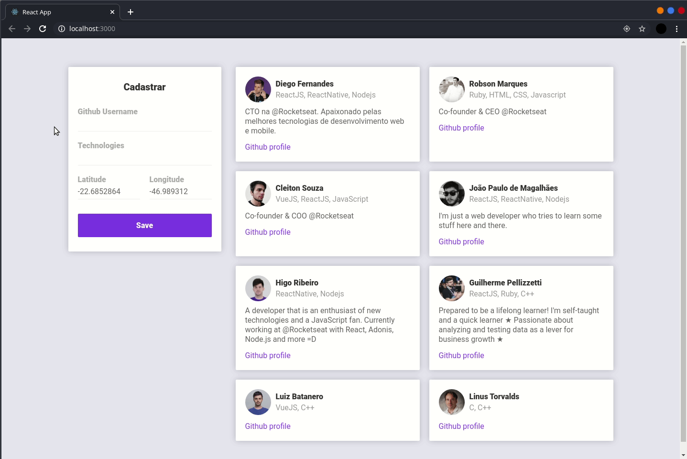
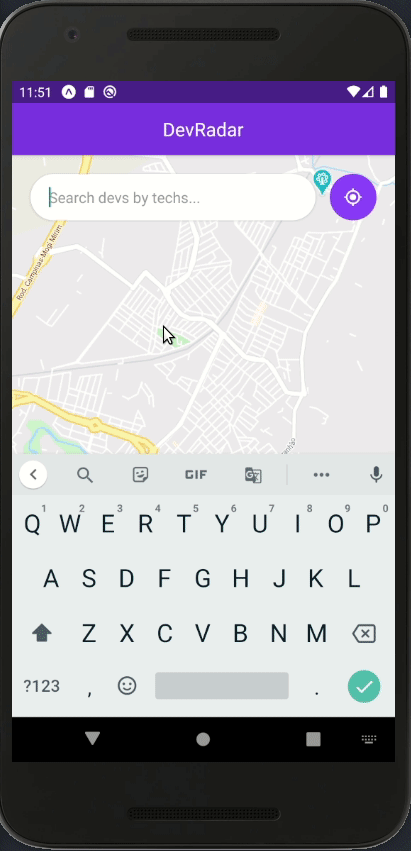
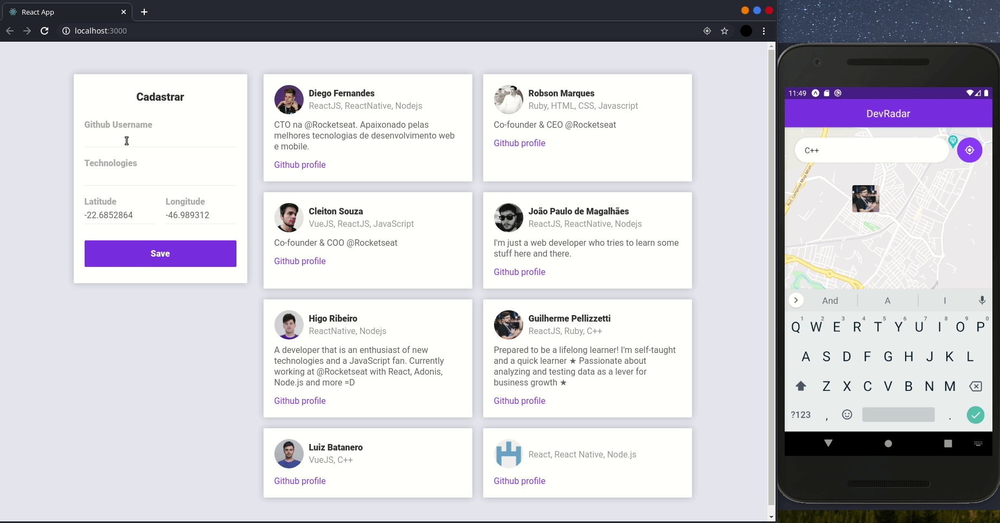

# Oministack Week 10
Aplicação desenvolvida na primeira semana Omnistack 10.0, promovida pela RocketSeat.

## Conceito

A ideia da semana Omnistack é desenvolver uma aplicação inteira do zero, realizando o desenvolvimento do backend,
capaz de responder às chamadas tanto do front-end quanto do mobile.

Na Omnistack 10.0, a ideia de uso seria o usuário cadastrar seu perfil gitHub e as tecnologias com que trabalha 
pela aplicação Web, capaz de capturar as coordenadas do usuário através da geolocalização do navegador. Já a aplicação 
mobile fica responsável por realizar a busca dos membros cadastrados dentro de um raio de 10km, que trabalhem com a 
tecnologia dada como input.

## Principais tecnologias utilizadas

* Node.js
* React
* React Native
* Socket.io
* MongoDB

## Características

Algumas das características implementadas nesse projeto.

### Cadastro

### Layout responsivo da aplicação web

### Aplicação mobile

Pesquisar devs que estejam em um raio de 10km de sua localização, pela tecnologia.

### Atualiação em tempo real através de WebSockets

Novos devs cadastrados são prontamente exibidos.

